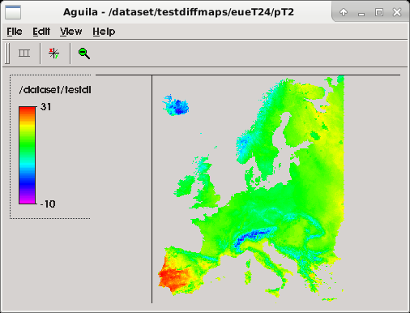
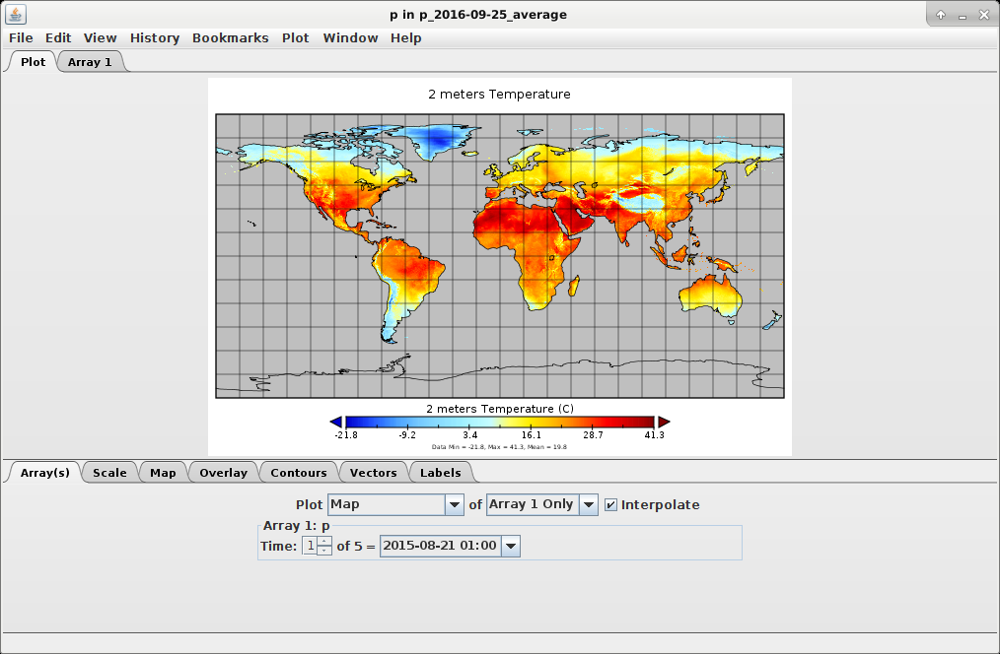

[ChangeLog](CHANGE_LOG.rst)


# pyg2p
pyg2p is a converter between GRIB and netCDF4/PCRaster files. 
It can also manipulates GRIB messages (performing aggregation or simple unit conversion) before to apply format conversion.

## Installation

To install package, you can use a python virtual environment or directly install dependencies and
package at system level (executable script will be saved into /usr/local/bin in this case).

>IMPORTANT: Before to launch setup, you need to configure geopotentials and intertables paths in
configuration/global/global_conf.json. These paths are used by pyg2p to read
geopotentials and intertables already configured. You may need to download files from FTP (launch `pyg2p -W` for this). 
Users running pyg2p installed by a different user (ie. root) will configure similar paths for their own intertables 
and geopotentials under his home folder. These paths will need write permissions.

Grab last archive and extract it in a folder (or clone this repository) and follow these steps:

```bash
$ cd pyg2p
$ vim configuration/global/global_conf.json # to edit shared paths !!!
$ python setup.py install
```

After installation, you will have all dependencies installed and an executable script 'pyg2p' (in a
virtual environment, script is located under <VIRTUALENV_PATH>/bin folder otherwise under
/usr/local/bin). Some python packages can be problematic to install at first shot. Read
following paragraph for details.

## Configuration

One of the things to configure for any user running pyg2p, is GEOPOTENTIALS and INTERTABLES
variables with paths to folders with write permissions.

>NOTE: From version 2.1, the user needs to setup these variables only if she/he
needs to write new interpolation tables (option -B [-X]) or to add new
geopotentials from grib files (option -g).

These variables contains user paths and must be configured in a .conf file (e.g. paths.conf) under
~/.pyg2p/ directory. This can look like:

```text
GEOPOTENTIALS=/dataset/pyg2p_data_user/geopotentials
INTERTABLES=/dataset/pyg2p_data_user/intertables
```

User intertables (for interpolation) are read/write from `INTERTABLES` and geopotentials (for
correction) are read from `GEOPOTENTIALS`.
Pyg2p will use its default configuration for available intertables and geopotentials. These are read
from paths configured during installation in global_conf.json.
If you need to download default files from ECMWF FTP, just launch pyg2p with -W option and the
dataset argument (argument can be *geopotentials* or *intertables*) and files are saved in user
paths configured above:

```bash
$ pyg2p -W intertables
```

You can edit FTP authentication parameters in *~/.pyg2p/ftp.json*

### Advanced configuration

User json configuration files are empty. If you need a new parameter or geopotential that is not
configured internally in pyg2p, you can setup new items (or overwrite internal configuration).

#### Adding a parameter to ~/.pyg2p/parameters.json

If you are extracting a parameter with shortName xy from a grib file that is not already globally
configured, add an element as shown below (only part in bold has been added):


```json
{
  "xy": {
    "@description": "Variable description",
    "@shortName": "xy",
    "@unit": "unitstring"
  }
}
```

You can configure (more than) a conversion element with different ids and functions. You will use
shortName and conversionId in the execution JSON templates.


```json
{
    "xy": { "@description": "Variable description",
    "@shortName": "xy",
    "@unit": "unitstring"
    },
    "xyz": {
    "@description": "Variable description",
    "@shortName": "xyz",
    "@unit": "unitstring/unistring2",
    "Conversion": [
        {
        "@cutOffNegative": true,
        "@function": "x=x*(-0.13)**2",
        "@id": "conv_xyz1",
        "@unit": "g/d"
        },
        {
        "@cutOffNegative": true,
        "@function": "x=x/5466 - (x**2)",
        "@id": "conv_xyz2",
        "@unit": "g/h"
        }
      ]
    }
}
```

>Note: Aware the syntax of conversion functions. They must start with x= followed
by the actual conversion formula where x is the value to convert. Units are only
used for logging.

#### Adding a geopotential for correction

If the input grib file has a geopotential message, pyg2p will use it for correction. Otherwise, it will
read the file from user data paths or global data paths.
To add a geopotential GRIB file to pyg2p configuration, use this command:

```bash
$ pyg2p -g path_to_geopotential_grib
```

This will copy the file to folder defined in `GEOPOTENTIALS` variable and will update
geopotentials.json with the new item.

#### Interpolation tables

Interpolation tables are read from user or global data folders.
If the table is missing, it will create it into user data folder for future interpolations (you must pass
-B option to pyg2p).
Depending on source and target grids size, and on interpolation method, table creation can take
from minutes to days. To speed up interpolation table creation, use parallel option -X to have up to
x6 speed gain.

### Execution templates

Execution templates are JSON files that you will use to configure a conversion. You will pass path to
the file to pyg2p with command line option `-c`.
Most of options can be both defined in this JSON file and from command line. 
**Note that command line options overwrite JSON template.**

If you have a large set of conversions for same parameters, it's more convenient to define a single
template where you define parameter, interpolation and aggregation and pass the rest of parameters from command line.
Here some examples of JSON commands files:

```json
{
    "Execution": {
        "@name": "Octahedral test 1",
        "Aggregation": {
            "@step": 24,
            "@type": "average"
        },
        "OutMaps": {
            "@cloneMap": "/dataset/maps/europe5km/dem.map",
            "@ext": 1,
            "@fmap": 1,
            "@namePrefix": "t2",
            "@unitTime": 24,
            "Interpolation": {
                "@latMap": "/dataset/maps/europe5km/lat.map",
                "@lonMap": "/dataset/maps/europe5km/long.map",
                "@mode": "grib_nearest"
            }
        },
        "Parameter": {
            "@applyConversion": "k2c",
            "@correctionFormula": "p+gem-dem*0.0065",
            "@demMap": "/dataset/maps/europe5km/dem.map",
            "@gem": "(z/9.81)*0.0065",
            "@shortName": "2t"
        }
    }
}
```

There are four sections of configuration.

#### Aggregation
Defines the aggregation method and step. Method can be `accumulation`, `average` or `instantaneous`.

#### OutMaps
Here you define interpolation method and paths to coordinates PCRaster maps, output unit time, the clone map etc.

#### Interpolation
This is a subelement of OutMaps. Here you define interpolation method (see later for details), paths
to coordinates maps.

#### Parameter
In this section, you configure the parameter to select by using its shortName, as stored in GRIB file.
You also configure conversion with applyConversion property set to a conversion id. Parameter
shortName must be already configured in `~/.pyg2p/parameters.json` along with conversion ids.
If you need to apply correction based on DEM files and geopotentials, you can configure formulas
and the path to DEM map.

#### Path configuration

You can use variables in JSON files to define paths. Variables can be configured in `.conf` files under
~/.pyg2p/ folder.
`/home/domenico/.pyg2p/myconf.conf`

```console
EUROPE_MAPS=/dataset/maps/europe5km
DEM_MAP=/dataset/maps/dem05.map
EUROPE_DEM=/dataset/maps/europe/dem.map
EUROPE_LAT=/dataset/maps/europe/lat.map
EUROPE_LON=/dataset/maps/europe/long.map
```

Usage of user defined paths in JSON command file:

```json
{ 
"Execution": {
  "@name": "eue_t24",
  "Aggregation": {
    "@step": 24,
    "@type": "average"
  },
  "OutMaps": {
        "@format": "netcdf",
        "@cloneMap": "{EUROPE_MAPS}/lat.map",
        "@ext": 1,
        "@fmap": 1,
        "@namePrefix": "pT24",
        "@unitTime": 24,
        "Interpolation": {
          "@latMap": "{EUROPE_MAPS}/lat.map",
          "@lonMap": "{EUROPE_MAPS}/long.map",
          "@mode": "grib_nearest"
        }
  },
  "Parameter": {
    "@applyConversion": "k2c",
    "@correctionFormula": "p+gem-dem*0.0065",
    "@demMap": "{DEM_MAP}",
    "@gem": "(z/9.81)*0.0065",
    "@shortName": "2t"
  }
 }
}
```

### Full list of options

<table> 
    <thead> 
        <tr> 
            <th>Section</th> 
            <th>Attribute</th> 
            <th>Description</th> 
        </tr> 
    </thead>
    <tbody>
        <tr>
        <td><b>Execution</b></td>
        <td>name</td>
        <td>Descriptive name of the execution configuration.</td>
        </tr>
        <tr>
        <td></td><td><b>Parameter</b></td><td>See relative table</td>
        </tr>
        <tr>
        <td></td><td><b>OutMaps</b></td><td>See relative table</td>
        </tr>
        <tr>
        <td></td><td><b>Parameter</b></td><td>See relative table</td>
        </tr>
        <tr>
        <td colspan="3"><hr/></td>
        </tr>
        <tr>
        <td><b>Parameter</b></td><td><b>shortName</b></td><td>The short name of the parameter, as it is in the grib file. The application use this to select messages. Must be configured in the parameters.json file, otherwise the application exits with an error.</td>
        </tr>
        <tr>
        <td>&nbsp;</td><td>tstart</td><td rowspan="6">Optional grib selectors perturbationNumber,
tstart, tend, dataDate and dataTime can also be
issued via command line arguments (-m, -s, -e,
-D, -T), which overwrite the ones in the
execution JSON file.</td>
        </tr>
        <tr>
        <td>&nbsp;</td><td>tend</td>
        </tr>
        <tr>
        <td>&nbsp;</td><td>perturbationNumber</td>
        </tr>
        <tr>
        <td>&nbsp;</td><td>dataDate</td>
        </tr>
        <tr>
        <td>&nbsp;</td><td>dataTime</td>
        </tr>
        <tr>
        <td>&nbsp;</td><td>level</td>
        </tr>
        <tr><td>&nbsp;</td><td>applyConversion</td><td>The conversion id to apply, as in the
parameters.json file for the parameter to select.
The combination parameter/conversion must be
properly configured in parmaters.json file,
otherwise the application exits with an error.</td></tr>
        <tr><td>&nbsp;</td><td>correctionFormula</td><td>Formula to use for parameter correction with p,
gem, dem variables, representing parameter
value, converted geopotential to gem, and DEM
map value. E.g.: p+gem*0.0065-dem*0.0065</td></tr>
        <tr><td>&nbsp;</td><td>demMap</td><td>The dem map used for correction.</td></tr>
        <tr><td>&nbsp;</td><td>gem</td><td>Formula for geopotential conversion for
correction.</td></tr>
        <tr>
        <td colspan="3"><hr/></td>
        </tr>
        <tr>
        <td><b>OutMaps</b></td><td>cloneMap</td><td>The clone map with area (must have a REAL cell
type and missing values for points outside area
of interest. A dem map works fine. A typical area boolean map will not).</td>
        </tr>
        <tr>
        <td>&nbsp;</td><td><b>unitTime</b></td><td>Time unit in hours of output maps. Tipical value
is 24 (daily maps).</td>
        </tr>
        <tr>
        <td>&nbsp;</td><td><b>format</b></td><td>Output file format. Default 'pcraster'. Available
formats are 'pcraster', 'netcdf'.</td>
        </tr>
        <tr>
        <td>&nbsp;</td><td><b>namePrefix</b></td><td>Prefix for maps. Default is parameter
shortName.</td>
        </tr>
        <tr>
        <td>&nbsp;</td><td><b>fmap</b></td><td>First PCRaster map number. Default 1.</td>
        </tr>
        <tr>
        <td>&nbsp;</td><td><b>Interpolation</b></td><td>See relative table.</td>
        </tr>
        <tr>
        <td>&nbsp;</td><td><b>ext</b></td><td>Extension mode. It's the integer number
defining the step numbers to skip when writing maps. Same as old grib2pcraster. Default 1.</td>
        </tr>
        <tr>
        <td colspan="3"><hr/></td>
        </tr>
        <tr>
        <td><b>Aggregation</b></td><td><b>step</b></td><td>Step of aggregation in hours.</td>
        </tr>
        <tr>
        <td>&nbsp;</td><td><b>type</b></td><td>Type of aggregation (it was Manipulation in
grib2pcraster). It can be average or accumulation.</td>
        </tr>
        <tr>
        <td>&nbsp;</td><td>forceZeroArray</td><td>Optional. In case of “accumulation”, and only
then, if this attribute is set to”y” (or any value different from “false”, “False”, “FALSE”, “no”,
“NO”, “No”, “0”), the program will use a zero array as message at step 0 to compute the first
map, even if the GRIB file has a step 0 message.</td>
        </tr>
        <tr>
        <td><b>Interpolation</b></td><td><b>mode</b></td><td>Interpolation mode. Possible values are:
“nearest”, “invdist”, “grib_nearest”,
“grib_invdist”</td>
        </tr>
        <tr>
        <td>&nbsp;</td><td><b>latMap</b></td><td>PCRaster map of target latitudes.</td>
        </tr>
        <tr>
        <td>&nbsp;</td><td><b>lonMap</b></td><td>PCRaster map of target longitudes.</td>
        </tr>
        <tr>
        <td>&nbsp;</td><td>intertableDir</td><td>Alternative home folder for interpolation lookup
tables, where pyg2p will load/save intertables. Folder must be existing. If not set, pyg2p will use intertables from ~/.pyg2p/intertables/</td>
        </tr>
    </tbody>
</table>

## Usage

To use the application, after the main configuration you need to configure a template JSON file for
each type of extraction you need to perform.

### Grabbing information from GRIB files.

To configure the application and compile your JSON templates, you might need to know the variable
shortName as stored in the input GRIB file you're using or in the geopotential GRIB. Just execute the
following GRIB tool command:

`grib_get -p shortName /path/to/grib`

Other keys you would to know for configuration or debugging purposes are:
* startStep
* endStep (for instantaneous messages, it can be the same of startStep)
* perturbationNumber (the EPS member number)
* stepType (type of field: instantaneous: 'instant', average: 'avg', cumulated: 'cumul')
* longitudeOfFirstGridPointInDegrees
* longitudeOfLastGridPointInDegrees
* latitudeOfFirstGridPointInDegrees
* latiitudeOfLastGridPointInDegrees
* Ni (it can be missing)
* Nj (it states the resolution: it's the number of points along the meridian)
* numberOfValues
* gridType (e.g.: regular_ll, reduced_gg, rotated_ll)

### Input arguments

If you run pyg2p without arguments, it shows help of all input arguments.

```console
usage: pyg2p [-h] [-c json_file] [-o out_dir] [-i input_file]
[-I input_file_2nd] [-s tstart] [-e tend] [-m eps_member]
[-T data_time] [-D data_date] [-f fmap] [-F format] [-x extension_step]
[-n outfiles_prefix] [-l log_level] [-N intertable_dir] [-B] [-X]
[-t cmds_file] [-g geopotential] [-C path] [-z path] [-W dataset]

Execute the grib to pcraster conversion using parameters from the input json configuration.
Read user manual.

optional arguments:
-h, --help show this help message and exit
-c json_file, --commandsFile json_file
Path to json command file
-o out_dir, --outDir out_dir
Path where output maps will be created.
-i input_file, --inputFile input_file
Path to input grib.
-I input_file_2nd, --inputFile2 input_file_2nd
Path to 2nd resolution input grib.
-s tstart, --start tstart
Grib timestep start. It overwrites the tstart in json
execution file.
-e tend, --end tend Grib timestep end. It overwrites the tend in json
execution file.
-m eps_member, --perturbationNumber eps_member
eps member number
-T data_time, --dataTime data_time
To select messages by dataTime key value
-D data_date, --dataDate data_date
<YYYYMMDD> to select messages by dataDate key value
-f fmap, --fmap fmap First map number
-F format, --format format
Output format. Available options: netcdf, pcraster.
Default pcraster
-x extension_step, --ext extension_step
Extension number step
-n outfiles_prefix, --namePrefix outfiles_prefix
Prefix name for maps
-l log_level, --loggerLevel log_level
Console logging level
-N intertable_dir, --intertableDir intertable_dir
interpolation tables dir
-B, --createIntertable
create intertable file
-X, --interpolationParallel
Use parallelization tools to make interpolation
faster.If -B option is not passed or intertable
already exists it does not have any effect.
-t cmds_file, --test cmds_file
Path to a text file containing list of commands,
defining a battery of tests. Then it will create diff
pcraster maps and log alerts if differences are higher
than a threshold (edit configuration in test.json)
-g geopotential, --addGeopotential geopotential
Add the file to geopotentials.json configuration file, to use for correction. The file will be copied into
the right folder (configuration/geopotentials) Note:
shortName of geopotential must be "fis" or "z"
-C path, --convertConf path
Convert old xml configuration to new json format
-z path, --convertIntertables path
Convert old pyg2p intertables to new version and copy
to user folders
-W dataset, --downloadConf dataset
Download intertables and geopotentials (FTP settings
defined in ftp.json)
```
#### Usage examples:

```bash
pyg2p -c ./exec1.json -i ./input.grib -o /out/dir -s 12 -e 36 -F netcdf
pyg2p -c ./exec2.json -i ./input.grib -o /out/dir -m 10 -l INFO --format netcdf
pyg2p -c ./exec3.json -i ./input.grib -I /input2ndres.grib -o /out/dir -m 10 -l DEBUG
pyg2p -g /path/to/geopotential/grib/file # add geopotential to configuration
pyg2p -t /path/to/test/commands.txt
pyg2p -h
```

```text
Note: Even if 'netcdf' format is used for output, paths to PCRaster clone/area,
latitudes and longitudes maps have to be setup in any case.
```

### Check output maps

After the execution, you can check output maps by using the PCRaster2 Aguila viewer for PCRaster
maps or the NASA Panoply3 viewer for NetCDF files.

`aguila /dataset/testdiffmaps/eueT24/pT240000.001`



`./panoply.sh /dataset/octahedral/out/grib_vs_scipy/global/ta/p_2016-09-25_average.nc`



Maps will be written in the folder specified by -o input argument. If this is missing, you will find
maps in the folder where you launched the application (./).
Refer to official documentation for further information about Aguila and Panoply.

## Interpolation modes

Interpolation is configured in JSON execution templates using the *Interpolation* attribute inside
*OutMaps*.
There are four interpolation methods available. Two are using GRIB_API nearest neighbours routines
while the other two leverage on Scipy kd_tree module.

```text
Note: GRIB_API does not implement nearest neighbours routing for rotated grids.
You have to use scipy methods and regular target grids (i.e.: latitudes and
longitudes PCRaster maps).
```

### Intertable creation
Interpolation will use precompiled intertables. They will be found in the path configured in
`INTERTABLES` folder (take into account that can potentially contains gigabytes of files) or in global
data path. You can also define an alternate intertables directory with -N argument (or
*@intertableDir* attribute in JSON template).

If interlookup table doesn't exist, the application will create one into `INTERTABLES` folder and
update intertables.json configuration **only if -B option is passed**, otherwise program will exit.
Be aware that for certain combination of grid and maps, the creation of the interlookup table (which
is a numpy array saved in a binary file) could take several hours or even days for GRIB interpolation
methods. 

To have better performances (up to x6 of gain) you can pass -X option to enable parallel
processing.

Performances are not comparable with scipy based interpolation (seconds or minutes) but this
option could not be viable for all GRIB inputs.

### GRIB/ecCodes API interpolation methods

To configure the interpolation method for conversion, set the @mode attribute in Execution/OutMaps/Interpolation property.

#### grib_nearest

This method uses GRIB API to perform nearest neighbour query.
To configure this method, define:

```json
"Interpolation": {
  "@latMap": "/dataset/maps/europe5km/lat.map",
  "@lonMap": "/dataset/maps/europe5km/long.map",
  "@mode": "grib_nearest"
}
```

#### grib_invdist
It uses GRIB_API to query for four neighbours and relative distances. It applies inverse distance
calculation to compute the final value.
To configure this method:

```json
"Interpolation": {
  "@latMap": "/dataset/maps/europe5km/lat.map",
  "@lonMap": "/dataset/maps/europe5km/long.map",
  "@mode": "grib_invdist"
}
```

### SciPy interpolation methods

#### nearest
It's the same nearest neighbour algorithm of grib_nearest but it uses the scipy kd_tree4 module to
obtain neighbours and distances.

```json
"Interpolation": {
  "@latMap": "/dataset/maps/europe5km/lat.map",
  "@lonMap": "/dataset/maps/europe5km/long.map",
  "@mode": "nearest"
}
```

#### invdist
It's the inverse distance algorithm with scipy.kd_tree , using 8 neighbours.

```json
"Interpolation": {
  "@latMap": "/dataset/maps/europe5km/lat.map",
  "@lonMap": "/dataset/maps/europe5km/long.map",
  "@mode": "invdist"
}
```

Attributes p, leafsize and eps for the kd tree algorithm are default in scipy library:

| Attribute | Details              |
|-----------|----------------------|
| p         | 2 (Euclidean metric) |
| eps       | 0                    |
| leafsize  | 10                   |


## OutMaps configuration

Interpolation is configured under the OutMaps tag. With additional attributes, you also configure
resulting PCRaster maps. Output dir is ./ by default or you can set it via command line using the
option -o (--outDir).

| Attribute      | Details                                                                                                                           |
|----------------|-----------------------------------------------------------------------------------------------------------------------------------|
| namePrefix     | Prefix name for output map files. Default is the value of shortName key.                                                          |
| **unitTime**   | Unit time in hours for results. This is used during aggregation operations.                                                       |
| fmap           | Extension number for the first map. Default 1.                                                                                    |
| ext            | Extension mode. It's the integer number defining the step numbers to skip when writing maps. Same as old grib2pcraster. Default 1.|
| **cloneMap**   | Path to a PCRaster clone map, needed by PCRaster libraries to write a new map on disk.                                            |

## Aggregation

Values from grib files can be aggregated before to write the final PCRaster maps. There are two kinds of aggregation available: average and accumulation. 
The JSON configuration in the execution file will look like:

```json
"Aggregation": {
  "@type": "average"
}
```

To better understand what these two types of aggregations do, the DEBUG output of execution is presented later in same paragraph.

### Average
Temperatures are often extracted as averages on 24 hours or 6 hours. Here's a typical execution configuration and the output of interest:

**cosmo_t24.json**

```json
"Execution": {
"@name": "cosmo_T24",
"Aggregation": {
"@step": 24,
"@type": "average"
},
"OutMaps": {
"@cloneMap": "/dataset/maps/europe/dem.map",
"@ext": 4,
"@fmap": 1,
"@namePrefix": "T24",
"@unitTime": 24,
"Interpolation": {
"@latMap": "/dataset/maps/europe/lat.map",
"@lonMap": "/dataset/maps/europe/lon.map",
"@mode": "nearest"
}
},
"Parameter": {
"@applyConversion": "k2c",
"@correctionFormula": "p+gem-dem*0.0065",
"@demMap": "/dataset/maps/europe/dem.map",
"@gem": "(z/9.81)*0.0065",
"@shortName": "2t"
}
}
}
}
```

**Command**
`pyg2p -l DEBUG -c /execution_templates/cosmo_t24.json -i /dataset/cosmo/2012111912_pf10_t2.grb -o ./cosmo -m 10`

**ext parameter**
ext value will affect numbering of output maps:

```console
[2013-07-12 00:06:18,545] :./cosmo/T24a0000.001 written!
[2013-07-12 00:06:18,811] :./cosmo/T24a0000.005 written!
[2013-07-12 00:06:19,079] :./cosmo/T24a0000.009 written!
[2013-07-12 00:06:19,349] :./cosmo/T24a0000.013 written!
[2013-07-12 00:06:19,620] :./cosmo/T24a0000.017 written!
```

This is needed because we performed 24 hours average over 6 hourly steps.

### Accumulation
For precipitation values, accumulation over 6 or 24 hours is often performed. Here's an example of configuration and execution output in DEBUG mode.

**dwd_r06.json**

```json

{"Execution": {
"@name": "dwd_rain_gsp",
"Aggregation": {
"@step": 6,
"@type": "accumulation"
},
"OutMaps": {
"@cloneMap": "/dataset/maps/europe/dem.map",
"@fmap": 1,
"@namePrefix": "pR06",
"@unitTime": 24,
"Interpolation": {
"@latMap": "/dataset/maps/europe/lat.map",
"@lonMap": "/dataset/maps/europe/lon.map",
"@mode": "nearest"
}
},
"Parameter": {
"@shortName": "RAIN_GSP",
"@tend": 18,
"@tstart": 12
}
}
}
```

**Command**
`pyg2p -l DEBUG -c /execution_templates/dwd_r06.json -i /dataset/dwd/2012111912_pf10_tp.grb -o ./cosmo -m 10`

**Output**
```console
[2013-07-11 23:33:19,646] : Opening the GRIBReader for
/dataset/dwd/grib/dwd_grib1_ispra_LME_2012111900
[2013-07-11 23:33:19,859] : Grib input step 1 [type of step: accum]
[2013-07-11 23:33:19,859] : Gribs from 0 to 78
...
...
[2013-07-11 23:33:20,299] : ******** **** MANIPULATION **** *************
[2013-07-11 23:33:20,299] : Accumulation at resolution: 657
[2013-07-11 23:33:20,300] : out[s:6 e:12 res:657 step-lenght:6] = grib:12 - grib:6 *
(24/6))
[2013-07-11 23:33:20,316] : out[s:12 e:18 res:657 step-lenght:6] = grib:18 - grib:12 *
(24/6))
```

```text
Note: If you want to perform accumulation from Ts to Te with an aggregation step
Ta, and Ts-Ta=0 (e.g. Ts=6h, Te=48h, Ta=6h), the program will select the first
message at step 0 if present in the GRIB file, while you would use a zero values
message instead.
To use a zero values array, set the attribute forceZeroArray to ”true” in the
Aggregation configuration element.
For some DWD5 and COSMO6 accumulated precipitation files, the first zero message is
an instant precipitation and the decision at EFAS was to use a zero message, as it
happens for UKMO extractions, where input GRIB files don't have a first zero step
message.
```

```bash
grib_get -p units,name,stepRange,shortName,stepType 2012111912_pf10_tp.grb

kg m**-2 Total Precipitation 0 tp instant
kg m**-2 Total Precipitation 0-6 tp accum
kg m**-2 Total Precipitation 0-12 tp accum
kg m**-2 Total Precipitation 0-18 tp accum
...
...
kg m**-2 Total Precipitation 0-48 tp accum
```

## Correction

Values from grib files can be corrected with respect to their altitude coordinate (Lapse rate
formulas). Formulas will use also a geopotential value (to read from a GRIB file, see later in this
chapter for configuration).
Correction has to be configured in the Parameter element, with three mandatory attributes.

* correctionFormula (the formula used for correction, with input variables parameter value (p), gem, and dem value.
* gem (the formula to obtain gem value from geopotential z value)
* demMap (path to the DEM PCRaster map)

`Note: formulas must be written in python notation.`

Tested configurations are only for temperature and are specified as follows:

**Temperature correction**

```json
"Parameter": {
  "@applyConversion": "k2c",
  "@correctionFormula": "p+gem-dem*0.0065",
  "@demMap": "/dataset/maps/europe/dem.map",
  "@gem": "(z/9.81)*0.0065",
  "@shortName": "2t"
}
```

**A more complicated correction formula:**

```json
"Parameter": {
  "@applyConversion": "k2c",
  "@correctionFormula": "p/gem*(10**((-0.159)*dem/1000))",
  "@demMap": "/dataset/maps/europe/dem.map",
  "@gem": "(10**((-0.159)*(z/9.81)/1000))",
  "@shortName": "2t"
}
```

### How to write formulas

**z** is the geopotential value as read from the grib file
**gem** is the value resulting from the formula specified in gem attribute I.e.: (gem="(10**((-0.159)*(z/9.81)/1000)))"
**dem** is the dem value as read from the PCRaster map

Be aware that if your dem map has directions values, those will be replicated in the final map.

### Which geopotential file is used?

The application will try to find a geopotential message in input GRIB file. If a geopotential message
is not found, pyg2p will select a geopotential file from user or global data paths, by selecting
filename from configuration according the geodetic attributes of GRIB message. If it doesn't find
any suitable grib file, application will exit with an error message.

Geodetic attributes compose the key id in the JSON configuration (note the $ delimiter):

`longitudeOfFirstGridPointInDegrees$longitudeOfLastGridPointInDegrees$Ni$Nj$numberOfValues$gridType`

If you want to add another geopotential file to the configuration, just execute the command:

`pyg2p -g /path/to/geopotential/grib/file`

The application will copy the geopotential GRIB file into `GEOPOTENTIALS` folder (under user home directory) 
and will also add the proper JSON configuration to geopotentials.json file.

## Conversion

Values from GRIB files can be converted before to write final output maps. Conversions are
configured in the parameters.json file for each parameter (ie. shortName).
 
The right conversion formula will be selected using the id specified in the *applyConversion* attribute, and the shortName
attribute of the parameter that is going to be extracted and converted.

Refer to Parameter configuration paragraph for details.

## Logging

Console logger level is INFO by default and can be optionally set by using **-l** (or **–loggerLevel**)
input argument.

Possible logger level values are ERROR, WARN, INFO, DEBUG, in increasing order of verbosity .

## pyg2p API
From version 1.3, pyg2p comes with a simple API to import and use from other python programs
(e.g. pyEfas).
The pyg2p API is intended to mimic the pyg2p.py script execution from command line so it provides
a Command class with methods to set input parameters and a *run_command(cmd)* module level function to execute pyg2p.

### Setting execution parameters

1. Create a pyg2p command:

```python
from pyg2p.main import api
command = api.command()
```

2. Setup execution parameters using a chain of methods (or single calls):

```python
command.with_cmdpath('a.json')
command.with_inputfile('0.grb')
command.with_log_level('ERROR').with_out_format('netcdf')
command.with_outdir('/dataout/').with_tstart('6').with_tend('24').with_eps('10').with_fmap('1')
command.with_ext('4')
print(str(command))
'pyg2p.py -c a.json -e 240 -f 1 -i 0.grb -l ERROR -m 10 -o /dataout/test -s 6 -x 4 -F netcdf'
```

You can also create a command object using the input arguments as you would do when execute pyg2p from command line:

```python
args_string = '-l ERROR -c /pyg2p_git/execution_templates_devel/eue_t24.json -i /dataset/test_2013330702/EpsN320-2013063000.grb -o /dataset/testdiffmaps/eueT24 -m 10'
command2 = api.command(args_string)
```

### Execute

Use the run_command function from pyg2p module. This will delegate the main method, without
shell execution.

```python
ret = api.run_command(command)
```

The function returns the same value pyg2p returns if executed from shell (0 for correct executions,
included those for which messages are not found).

### Adding geopotential file to configuration

You can add a geopotential file to configuration from pyg2p API as well, using Configuration classes:

```python
from pyg2p.main.config import UserConfiguration, GeopotentialsConfiguration
user=UserConfiguration()
geopotentials=GeopotentialsConfiguration(user)
geopotentials.add('path/to/geopotential.grib')
```

The result will be the same as executing `pyg2p -g path/to/geopotential.grib`.

## Appendix A - Execution JSON files examples

This paragraph will explain typical execution json configurations.

### Example 1: Correction with dem and geopotentials

```shell script
pyg2p -c example1.json -i /dataset/cosmo/2012111912_pf2_t2.grb -o ./out_1
```

**example1.json**
```json
{
  "Execution": {
    "@name": "eue_t24",
    "Aggregation": {
      "@step": 24,
      "@type": "average"
    },
    "OutMaps": {
      "@cloneMap": "{EUROPE_MAPS}/lat.map",
      "@ext": 1,
      "@fmap": 1,
      "@namePrefix": "pT24",
      "@unitTime": 24,
      "Interpolation": {
        "@latMap": "{EUROPE_MAPS}/lat.map",
        "@lonMap": "{EUROPE_MAPS}/long.map",
        "@mode": "grib_nearest"
      }
    },
    "Parameter": {
        "@applyConversion": "k2c",
        "@correctionFormula": "p+gem-dem*0.0065",
        "@demMap": "{DEM_MAP}",
        "@gem": "(z/9.81)*0.0065",
        "@shortName": "2t"
    }
  }
}
```

This configuration, will select the 2t parameter from time step 0 to 12, out of a cosmo t2 file. 
Values will be corrected using the dem map and a geopotential file as in geopotentials.json configuration.

Maps will be written under ./out_1 folder (the folder will be created if not existing yet). The clone map is set as same as dem.map. 

>Note that paths to maps uses variables `EUROPE_MAPS` and `DEM_MAP`. 
>You will set these variables in myconf.conf file under ~/.pyg2p/ folder.

The original values will be converted using the conversion “k2c”. This conversion must be
configured in the parameters.json file for the variable which is being extracted (2t). See Parameter
property configuration at Parameter.
The interpolation method is grib_nearest. Latitudes and longitudes values will be used only if the
interpolation lookup table (intertable) hasn't be created yet but it's mandatory to set latMap and
lonMap because the application uses their metadata raster attributes to select the right intertable.
The table filename to be read and used for interpolation is automatically found by the application,
so there is no need to specify it in configuration. However, lat and lon maps are mandatory
configuration attributes.

### Example 2: Dealing with multiresolution files

```shell script
pyg2p -c example1.json -i 20130325_en0to10.grib -I 20130325_en11to15.grib -o ./out_2
```

Performs accumulation 24 hours out of sro values of two input grib files having different vertical
resolutions. You can also feed pyg2p with a single multiresolution file.

```shell script
pyg2p -c example1.json -i 20130325_sro_0to15.grib o ./out_2 -m 0
```

```json
{
  "Execution": {
    "@name": "multi_sro",
    "Aggregation": {
      "@step": 24,
      "@type": "accumulation"
    },
    "OutMaps": {
      "@cloneMap": "/dataset/maps/global/dem.map",
      "@fmap": 1,
      "@namePrefix": "psro",
      "@unitTime": 24,
      "Interpolation": {
        "@latMap": "/dataset/maps/global/lat.map",
        "@lonMap": "/dataset/maps/global/lon.map",
        "@mode": "grib_nearest"
      }
    },
    "Parameter": {
      "@applyConversion": "m2mm",
      "@shortName": "sro",
      "@tend": 360,
      "@tstart": 0
    }
  }
}
```

This execution configuration will extract global overlapping messages sro (perturbation number 0)
from two files at different resolution.
Values will be converted using “tomm” conversion and maps (interpolation used here is
grib_nearest) will be written under ./out_6 folder.

### Example 3: Accumulation 24 hours

```shell script
./pyg2p.py -i /dataset/eue/EpsN320-2012112000.grb -o ./out_eue -c execution_file_examples/execution_9.json
```

```json
{
  "Execution": {
    "@name": "eue_tp",
    "Aggregation": {
      "@step": 24,
      "@type": "accumulation"
    },
    "OutMaps": {
      "@cloneMap": "/dataset/maps/europe5km/lat.map",
      "@fmap": 1,
      "@namePrefix": "pR24",
      "@unitTime": 24,
      "Interpolation": {
        "@latMap": "/dataset/maps/europe5km/lat.map",
        "@lonMap": "/dataset/maps/europe5km/long.map",
        "@mode": "grib_nearest"
      }
    },
    "Parameter": {
      "@applyConversion": "tomm",
      "@shortName": "tp"
    }
  }
}
```

## Appendix B – Netcdf format output

```prettier
Format: NETCDF4_CLASSIC.
Convention: CF-1.6
Dimensions:
        xc: Number of rows of area/clone map
        yc: Number of cols of area/clone map
        time: Unlimited dimension for time steps
Variables:
        lon: 2D array with shape (yc, xc)
        lat: 2D array with shape (yc, xc)
        time_nc: 1D array of values representing hours since dataDate of first grib message (endStep)
        values_nc: a 3D array of dimensions (time, yc, xc), with coordinates set to 'lon, lat'.
```
